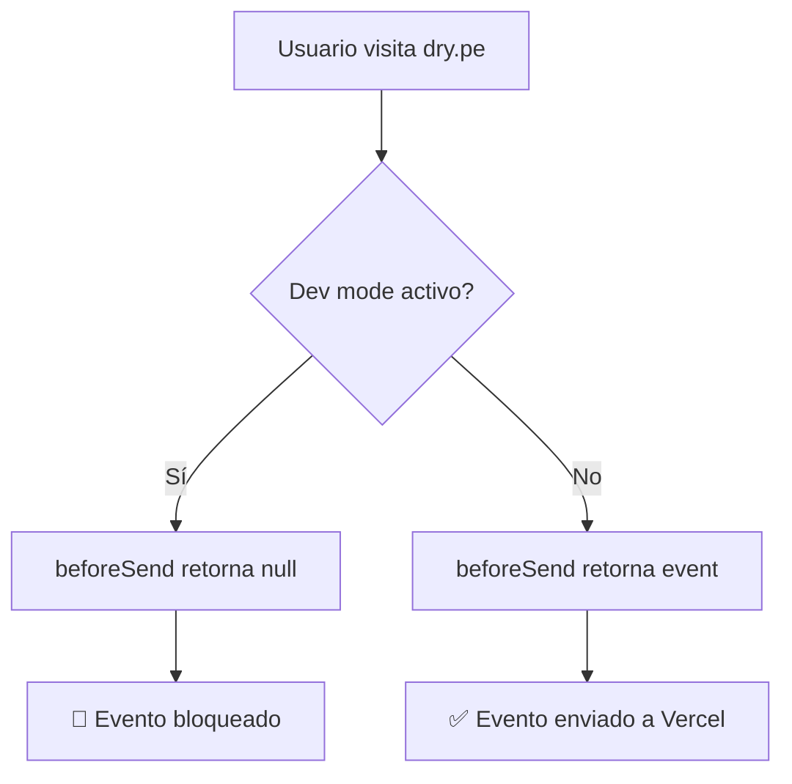

# Analytics Filtering - Dev User Mode

## Problema

Cuando navegas tu propio sitio (dry.pe) desde tu MacBook o iPhone, tus visitas se trackean en Vercel Analytics y "contaminan" la data de usuarios reales.

## Solución

Implementamos un sistema de **Dev User Mode** que filtra tu tráfico usando `localStorage` + `beforeSend` callback.

---

## Cómo Activar Dev Mode

### Opción 1: URL Parameter (Recomendado)

**En tu MacBook:**
1. Abre Chrome/Safari
2. Ve a: `https://dry.pe?dev=true`
3. Verás en consola: `✅ Dev mode enabled - Analytics disabled`
4. Cierra la pestaña

**En tu iPhone:**
1. Abre Safari
2. Ve a: `https://dry.pe?dev=true`
3. Agrega a favoritos o Home Screen
4. Desde ahora, tus visitas NO se trackean

### Opción 2: Consola del navegador

```javascript
// Activar dev mode
localStorage.setItem('sv-dev-user', 'true')

// Desactivar dev mode
localStorage.removeItem('sv-dev-user')

// Verificar estado
localStorage.getItem('sv-dev-user') // returns 'true' or null
```

### Opción 3: Toggle visual (Ctrl+Shift+D)

1. En cualquier página, presiona: `Ctrl + Shift + D`
2. Aparecerá un botón flotante en la esquina inferior derecha
3. Click para toggle entre dev mode ON/OFF

---

## Verificar que Funciona

### En la Consola del Navegador:

Con dev mode **ACTIVADO**:
```
🚫 Analytics blocked (dev user mode)
```

Con dev mode **DESACTIVADO**:
```
(No aparece ningún mensaje)
```

### En Vercel Analytics Dashboard:

- Navega dry.pe con dev mode activado
- Espera 5 minutos
- Ve a Vercel Dashboard → Analytics
- Tu visita **NO** debería aparecer

---

## Configuración por Dispositivo

| Dispositivo | Cómo activar | Persiste |
|------------|-------------|----------|
| **MacBook (Chrome)** | Visitar `dry.pe?dev=true` | ✅ Sí (localStorage) |
| **MacBook (Safari)** | Visitar `dry.pe?dev=true` | ✅ Sí (localStorage) |
| **iPhone (Safari)** | Visitar `dry.pe?dev=true` | ✅ Sí (localStorage) |
| **iPad** | Visitar `dry.pe?dev=true` | ✅ Sí (localStorage) |
| **Modo Incógnito** | ❌ No funciona | ❌ No (se borra al cerrar) |

---

## Desactivar Dev Mode

Para volver a trackear tus visitas (útil para testing):

```
https://dry.pe?dev=false
```

O desde la consola:
```javascript
localStorage.removeItem('sv-dev-user')
```

---

## Cómo Funciona Técnicamente

### Componentes

**1. AnalyticsWrapper (`src/components/analytics-wrapper.tsx`)**
- Envuelve el componente `<Analytics />`
- Usa `beforeSend` callback para filtrar eventos
- Chequea `localStorage.getItem('sv-dev-user')`
- Retorna `null` si dev mode está activo (bloquea el evento)

**2. DevModeToggle (`src/components/dev-mode-toggle.tsx`)**
- Escucha URL parameter `?dev=true` / `?dev=false`
- Provee toggle visual con `Ctrl+Shift+D`
- Sincroniza estado con localStorage

### Flujo



### Código del beforeSend

```typescript
beforeSend={(event) => {
  if (typeof window !== 'undefined') {
    const isDevUser = localStorage.getItem('sv-dev-user') === 'true'

    if (isDevUser) {
      console.log('🚫 Analytics blocked (dev user mode)')
      return null // Block event
    }
  }

  return event // Send normally
}}
```

---

## Limitaciones

1. **Solo funciona en el mismo navegador**: Si usas Chrome para activar dev mode, Safari seguirá trackeando.
2. **No funciona en modo incógnito**: localStorage se borra al cerrar.
3. **Requiere JavaScript**: Si JS está deshabilitado, se trackea todo.
4. **No filtra por IP**: No hay forma de filtrar automáticamente por IP en Vercel Analytics.

---

## Troubleshooting

### "Mis visitas siguen apareciendo"

**Posibles causas:**
1. Dev mode no está activado en ese navegador/dispositivo
2. Usaste modo incógnito (localStorage se borró)
3. Limpiaste cookies/localStorage manualmente
4. Estás usando un navegador diferente

**Solución:**
```bash
# Verifica en consola:
localStorage.getItem('sv-dev-user')

# Si retorna null, activa de nuevo:
localStorage.setItem('sv-dev-user', 'true')
```

### "No veo el toggle visual"

Presiona `Ctrl + Shift + D` para mostrarlo.

### "Quiero trackear temporalmente"

Desactiva dev mode:
```
https://dry.pe?dev=false
```

Cuando termines, vuelve a activar:
```
https://dry.pe?dev=true
```

---

## Configuración Recomendada

**Para ti (Jorge):**
1. Activa dev mode en:
   - ✅ MacBook Chrome
   - ✅ MacBook Safari
   - ✅ iPhone Safari
   - ✅ iPad Safari (si tienes)

2. Deja desactivado en:
   - ❌ Navegadores de testing (para probar analytics)

**Para el equipo:**
- Cada desarrollador puede activar dev mode en sus dispositivos
- No afecta a usuarios reales (no tienen el flag)

---

## Deployment

Los archivos ya están integrados en el layout:

```typescript
// src/app/layout.tsx
import { AnalyticsWrapper } from '@/components/analytics-wrapper'
import { DevModeToggle } from '@/components/dev-mode-toggle'

<body>
  {children}
  <AnalyticsWrapper />
  <DevModeToggle />
</body>
```

Solo necesitas deployar:
```bash
git add .
git commit -m "Add: Analytics dev user filtering"
git push
```

Vercel autodeploy hará el resto.

---

## Alternativas Consideradas

| Método | Pros | Contras | Elegido |
|--------|------|---------|---------|
| **IP Filtering** | Automático | Vercel no lo soporta | ❌ |
| **User Agent** | Simple | Fácil de falsificar | ❌ |
| **beforeSend + localStorage** | Persiste, fácil de usar | Manual por dispositivo | ✅ |
| **Custom analytics service** | Control total | Costo + complejidad | ❌ |

---

**Última actualización:** 2025-11-23
