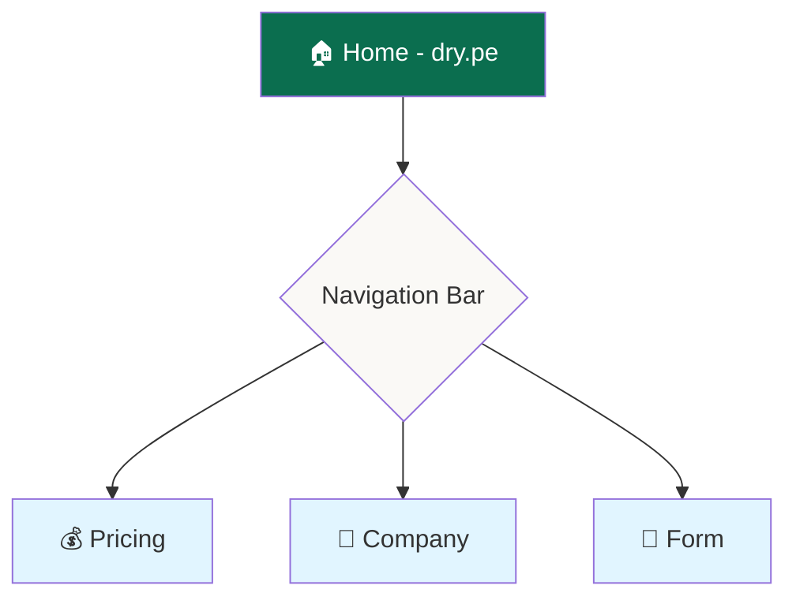
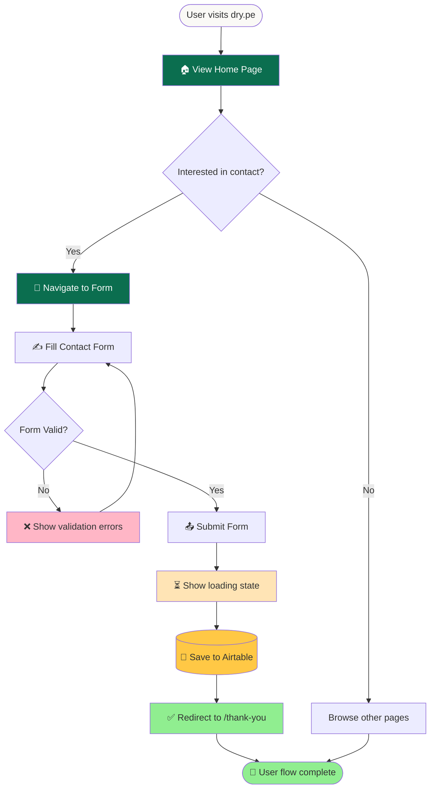

# SV Web - Company Website

## Project Objective

**Purpose:** Company website for SV (dry.pe) with informational pages and lead capture form.

**Key Features:**
- Static Site Generation (SSG) for informational pages: Home, Pricing, Company
- Contact form for potential clients
- Form submissions saved to Airtable via API routes
- Server-side rendering with Next.js App Router
- Lightning-fast page loads (pre-rendered at build time)
- Clean, accessible design based on Tailwind Plus "Radiant" template
- React components with TypeScript

**Target User:** Potential clients visiting dry.pe to learn about services and submit inquiries

---

## Sitemap

**Domain:** dry.pe

**Site Structure:**



**Pages:**
1. **Home** (`/`) - Landing page with main value proposition
2. **Pricing** (`/pricing`) - Pricing plans and packages
3. **Company** (`/company`) - About the company, team, mission
4. **Form** (`/form`) - Contact form for potential clients
5. **Thank You** (`/thank-you`) - Success page after form submission
6. **Terms** (`/terms`) - Terms of Service
7. **Privacy** (`/privacy`) - Privacy Policy

---

## User Flow - Main Journey

**Primary Flow:** Home → Form → Form Submission



**Key Steps:**
1. **Landing** - User enters home page
2. **Navigation** - User clicks Form in navigation bar
3. **Form Entry** - User fills contact form with their information (visible fields only)
4. **Validation** - Client-side validation (required fields, email format)
5. **Submission** - Form POST to `/api/contact` via fetch (includes hidden fields auto-filled)
6. **API Processing** - Next.js API route saves to Airtable (handles company linking)
7. **Confirmation** - User redirects to `/thank-you` page
8. **Completion** - User flow ends

---

## Contact Form Fields

**Form Schema:**

| Field          | Type         | Visible | Required | Default Value        | Validation                    | Description                   |
| -------------- | ------------ | ------- | -------- | -------------------- | ----------------------------- | ----------------------------- |
| `email`        | Email input  | ✅ Yes   | ✅ Yes    | -                    | Valid email format            | User's email address          |
| `contact_name` | Text input   | ✅ Yes   | ✅ Yes    | -                    | Min 2 characters              | Full name of contact          |
| `phone_number` | Tel input    | ✅ Yes   | ❌ No     | -                    | Valid phone format (optional) | Contact phone number          |
| `company`      | Text input   | ✅ Yes   | ❌ No     | -                    | -                             | Company name (if applicable)  |
| `contact_type` | Hidden input | ❌ No    | ✅ Yes    | `'potential_client'` | -                             | Auto-filled: potential_client |
| `inquiry_type` | Hidden input | ❌ No    | ✅ Yes    | `'sales_inquiry'`    | -                             | Auto-filled: sales_inquiry    |

**Visible Fields (4):**
- `email` (required)
- `contact_name` (required)
- `phone_number` (optional)
- `company` (optional - text input, will be linked to companies table)

**Hidden Fields (2):**
- `contact_type` = `'potential_client'` (auto-filled)
- `inquiry_type` = `'sales_inquiry'` (auto-filled)

**Airtable Structure:**
- **Database:** Existing Airtable base (SV Contacts)
- **Table name:** `contacts` (existing table - `tblO9hrrMu1gfvKzU`)
- **Related table:** `companies` (existing table - `tblihUO6jVOu6jsFb`)

**Field Mapping:**
- `email` → email (type: email)
- `contact_name` → contact_name (type: singleLineText)
- `phone_number` → phone_number (type: phoneNumber)
- `contact_type` → contact_type (type: singleSelect: 'potential_client')
- `inquiry_type` → inquiry_type (type: singleSelect: 'sales_inquiry')
- `company` → company (type: multipleRecordLinks to companies table)

**Company Field Logic:**
When user provides a company name:
1. **Search** in `companies` table for matching `company_name`
2. **If exists:** Get record ID and link to contact
3. **If not exists:**
   - Create new record in `companies` table with `company_name`
   - Get new record ID
   - Link to contact
4. **If empty:** Leave company field empty in contact record

**1Password CLI Access:**
```bash
# Get Airtable Personal Access Token
op item get "airtable sv contacts" --fields credential

# Get Database ID
op item get "airtable sv contacts" --fields "database id"

# Export as environment variables
export AIRTABLE_TOKEN=$(op item get "airtable sv contacts" --fields credential)
export AIRTABLE_BASE_ID=$(op item get "airtable sv contacts" --fields "database id")
```

**Credentials:**
- **1Password Item:** `airtable sv contacts`
- **Token field:** `credential` (Personal Access Token)
- **Base ID field:** `database id`
- **Base ID:** `appA0WSlDK9LGaeLr`

---

## Implementation Rules

**Next.js App Router Philosophy**

**Static Pages (Home, Pricing, Company):**
- Pre-rendered at build time using Static Site Generation (SSG)
- Optimal performance and SEO
- Server Components by default (no unnecessary client JS)
- Use `"use client"` directive only when needed for interactivity

**Dynamic Endpoints (API Routes):**
- `/api/contact` runs server-side only
- Handles form submission
- Never ships to client
- Uses Next.js Route Handlers in `app/api/` directory

**Client Components Strategy:**
Use Client Components (`"use client"`) only for:
- Interactive UI elements (buttons with onClick, forms with validation)
- State management (useState, useReducer)
- Browser APIs (localStorage, window, document)
- Animation libraries (framer-motion)

**Component Architecture:**
- Default: Server Components (no client JS)
- Interactive: Client Components with `"use client"` directive
- Keep client components small and focused
- Minimize client-side JavaScript bundle

---

## Tech Stack

### Framework
- **Next.js 15.x** (React Framework with App Router)
- Build Output: Static HTML/CSS + optimized JavaScript bundles
- Rendering: Static Site Generation (SSG) for pages
- Runtime: Node.js for API routes (server-side only)

### Frontend
- **React 19** - UI library
- **TypeScript** - Type safety
- **Tailwind CSS 4.x** - Utility-first styling
- **Tailwind Plus "Radiant" template** - Base design components
- **Framer Motion** - Animations (when needed)
- **Headless UI** - Accessible interactive components

### Backend
- Next.js API Routes (Route Handlers in `app/api/`)
- Airtable JavaScript SDK (`airtable` package)
- Environment variables via `.env.local`

### Database
- **Airtable** - Contact form data storage (required)
- Tables: `contacts`, `companies`

### Deployment
- **Vercel** (recommended) - Zero config for Next.js
- Build command: `next build`
- Output: `.next/` folder (static files + serverless functions)
- Environment variables configured in Vercel dashboard

### UI Components Strategy
- **Default:** Server Components (no client JS)
- **Interactive needs:** Client Components with `"use client"`
- **Styling:** Tailwind CSS utility classes
- **Base components:** From Tailwind Plus Radiant template

---

## Database - Airtable Integration

**Current Setup:**
- Using **existing** Airtable base (SV Contacts)
- Tables: `contacts` and `companies` (already configured)
- Credentials: 1Password CLI
- Access: Airtable JavaScript SDK via Next.js API Routes

**For This Project:**
- ✅ Use existing schema (no modifications needed)
- ✅ Form submits to existing `contacts` table via POST to `/api/contact`
- ✅ Company linking handled automatically in API route

**Form Implementation with Next.js:**

```typescript
// app/api/contact/route.ts
import { NextRequest, NextResponse } from 'next/server';
import Airtable from 'airtable';

export async function POST(request: NextRequest) {
  const formData = await request.formData();
  const email = formData.get('email') as string;
  const contact_name = formData.get('contact_name') as string;
  const phone_number = formData.get('phone_number') as string;
  const company = formData.get('company') as string;

  // Auto-filled hidden fields
  const contact_type = 'potential_client';
  const inquiry_type = 'sales_inquiry';

  // Initialize Airtable
  const base = new Airtable({ apiKey: process.env.AIRTABLE_TOKEN })
    .base(process.env.AIRTABLE_BASE_ID!);

  // 1. Handle company linking (if provided)
  // 2. Create contact record
  // 3. Return success response

  return NextResponse.json({ success: true }, { status: 200 });
}
```

**Form Page (Client Component - Fixed Duplicate Submission Bug):**
```tsx
// app/form/page.tsx
'use client'

import { useState } from 'react'
import { useRouter } from 'next/navigation'
import { Container } from '@/components/container'
import { Navbar } from '@/components/navbar'
import { Footer } from '@/components/footer'
import { Heading, Lead } from '@/components/text'

export default function ContactForm() {
  const [isSubmitting, setIsSubmitting] = useState(false)
  const [error, setError] = useState<string | null>(null)
  const router = useRouter()

  const handleSubmit = async (e: React.FormEvent<HTMLFormElement>) => {
    e.preventDefault() // Prevents native form submission (fixes duplicate bug)
    setIsSubmitting(true)
    setError(null)

    const formData = new FormData(e.currentTarget)

    try {
      const response = await fetch('/api/contact', {
        method: 'POST',
        body: formData,
      })

      const data = await response.json()

      if (!response.ok) {
        throw new Error(data.error || 'Failed to submit form')
      }

      router.push('/thank-you') // Redirect on success
    } catch (err) {
      setError(err instanceof Error ? err.message : 'An error occurred')
      setIsSubmitting(false)
    }
  }

  return (
    <main>
      <Container>
        <Navbar />
      </Container>
      <Container className="mt-16">
        <Heading as="h1">Get in touch</Heading>
        <Lead className="mt-6 max-w-3xl">
          Contact us to learn more about our services.
        </Lead>

        <form onSubmit={handleSubmit} className="mt-10 max-w-lg">
          <input
            type="email"
            name="email"
            required
            disabled={isSubmitting}
            placeholder="your@email.com"
            className="w-full rounded-lg border px-4 py-2"
          />
          <input
            type="text"
            name="contact_name"
            required
            minLength={2}
            disabled={isSubmitting}
            placeholder="Full Name"
            className="mt-4 w-full rounded-lg border px-4 py-2"
          />
          <input
            type="tel"
            name="phone_number"
            disabled={isSubmitting}
            placeholder="+51 999 999 999"
            className="mt-4 w-full rounded-lg border px-4 py-2"
          />
          <input
            type="text"
            name="company"
            disabled={isSubmitting}
            placeholder="Company Name (optional)"
            className="mt-4 w-full rounded-lg border px-4 py-2"
          />

          {error && (
            <div className="mt-4 rounded-lg bg-red-50 p-4 text-sm text-red-600">
              {error}
            </div>
          )}

          <button
            type="submit"
            disabled={isSubmitting}
            className="mt-6 rounded-lg bg-green-700 px-6 py-3 text-white disabled:opacity-50"
          >
            {isSubmitting ? 'Sending...' : 'Submit'}
          </button>
        </form>
      </Container>
      <Footer />
    </main>
  )
}

// Why Client Component?
// - Prevents duplicate submissions: e.preventDefault() stops native form behavior
// - Loading state: Shows "Sending..." and disables form during submission
// - Error handling: Displays error messages inline
// - Redirect: Programmatically navigates to /thank-you on success
// - Better UX: Controlled submission flow prevents browser quirks
```

---

## Known Issues & Solutions

### ⚠️ Form Duplicate Submission Bug (SOLVED)

**Problem Discovered:**
- Form was submitting twice to Airtable, creating duplicate contact records
- Issue appeared consistently on mobile devices during testing
- Server logs showed `POST /api/contact 200` appearing twice for single submission

**Root Cause:**
- Native HTML form submission (`<form method="POST" action="/api/contact">`)
- Browser behavior + potential double-tap on mobile
- No client-side submission control

**Solution Implemented:**
- ✅ Converted form from Server Component to Client Component (`'use client'`)
- ✅ Added `e.preventDefault()` to prevent native form submission
- ✅ Implemented controlled submission with `fetch()` API
- ✅ Added loading state (`isSubmitting`) to disable form during submission
- ✅ Added redirect to `/thank-you` page on success
- ✅ Added error handling with user-friendly error display

**File Modified:** `/Users/vicuna/sv-web/src/app/form/page.tsx`

**Key Code Change:**
```tsx
const handleSubmit = async (e: React.FormEvent<HTMLFormElement>) => {
  e.preventDefault() // Critical: stops native form submission
  setIsSubmitting(true)

  const formData = new FormData(e.currentTarget)
  const response = await fetch('/api/contact', { method: 'POST', body: formData })

  if (response.ok) {
    router.push('/thank-you') // Redirect instead of inline message
  }
}
```

**Result:**
- ✅ Zero duplicate submissions
- ✅ Better UX with loading state
- ✅ Proper error handling
- ✅ Clean redirect flow

---

**Reference: Airtable Schema Management** (for future modifications)

**What Each Method Can Do:**

**REST API:**
- ✅ Create: tables, basic fields (text, number, select, checkbox, url, date, links)
- ❌ Cannot: autoNumber, timestamps, rollup, formula, delete fields

**AI Assist Chat on Airtable:**
- ✅ Create: rollup, createdTime, lastModifiedTime
- ❌ Cannot: delete fields, create tables
- ⚠️ Inconsistent: works best with ≤5 tasks at a time (60-100% success)

**Manual UI:**
- ✅ Can do: EVERYTHING (only way to delete fields/tables)

**Recommended Workflow** (if schema changes needed):
1. REST API → Create tables + basic fields
2. AI Assist → Add rollups + timestamps (small batches, verify after)
3. Manual UI → Delete legacy fields + final cleanup

---

## Current Implementation Status

### ✅ Completed Features

**Pages Implemented (7 total):**
1. ✅ **Home** (`/`) - Landing page with value proposition
2. ✅ **Pricing** (`/pricing`) - Pricing information (using template content)
3. ✅ **Company** (`/company`) - About page (using template content)
4. ✅ **Form** (`/form`) - Contact form with Airtable integration
5. ✅ **Thank You** (`/thank-you`) - Post-submission success page
6. ✅ **Terms** (`/terms`) - Terms of Service (12 sections)
7. ✅ **Privacy** (`/privacy`) - Privacy Policy (13 sections, GDPR-style)

**UI Customizations:**
- ✅ Reduced testimonials from 6 to 2 (Maria Rodriguez, Carlos Mendoza)
- ✅ Removed pagination dots (unnecessary with only 2 items)
- ✅ Replaced template logos with 5 real client logos:
  - Crehana
  - AEA (Asociación de Exportadores Agrarios)
  - Interbank
  - PUCP (Pontificia Universidad Católica del Perú)
  - Rimac
- ✅ Fixed logo dimensions with `object-contain` + `max-w-*` classes
- ✅ Cleaned footer: removed broken links (Analysis, API, Help center, Community)
- ✅ Reduced social icons to LinkedIn only

**Technical Implementation:**
- ✅ Contact form with Airtable integration
- ✅ Company auto-creation and linking logic
- ✅ Form duplicate submission bug fixed (Client Component approach)
- ✅ Loading states and error handling
- ✅ Mobile-responsive design
- ✅ Environment variables configured (`.env.local`)
- ✅ Production build successful

**Development Setup:**
- ✅ Local dev server: `http://192.168.68.106:3000`
- ✅ Mobile testing accessible on WiFi network
- ✅ Template: Tailwind Plus "Radiant" (Next.js TypeScript version)

### 📝 Pending Tasks

**Content:**
- ⏳ Update Pricing page with actual SV pricing (currently using template content)
- ⏳ Update Company page with actual SV company info (currently using template content)
- ⏳ Update Home page testimonials with real quotes (if available)

**Deployment:**
- ⏳ Configure Vercel project
- ⏳ Set up dry.pe domain in Vercel
- ⏳ Configure environment variables in Vercel dashboard
- ⏳ Production deployment

**Optional Enhancements:**
- ⏳ Add Google Analytics / tracking
- ⏳ Add rate limiting to contact form API
- ⏳ Add CAPTCHA if spam becomes an issue
- ⏳ Create custom 404 page
- ⏳ Create custom favicon
- ⏳ Add Open Graph meta tags for social sharing

### 🗂️ File Structure

```
/Users/vicuna/sv-web/
├── src/
│   ├── app/
│   │   ├── page.tsx (Home)
│   │   ├── pricing/page.tsx
│   │   ├── company/page.tsx
│   │   ├── form/page.tsx (Client Component - fixed duplicates)
│   │   ├── thank-you/page.tsx
│   │   ├── terms/page.tsx
│   │   ├── privacy/page.tsx
│   │   ├── api/
│   │   │   └── contact/route.ts (Airtable integration)
│   │   └── layout.tsx
│   └── components/
│       ├── navbar.tsx (updated navigation)
│       ├── footer.tsx (cleaned links, Privacy link added)
│       ├── testimonials.tsx (reduced to 2 items)
│       └── logo-cloud.tsx (real client logos)
├── public/
│   └── logo-cloud/ (5 client logo PNGs)
├── .env.local (Airtable credentials)
├── CLAUDE.md (this file - project spec)
└── package.json
```

---
